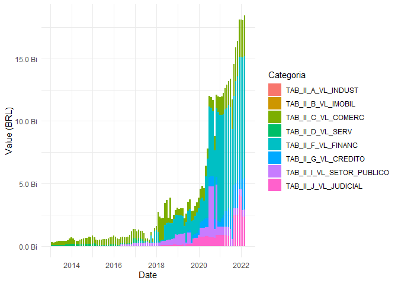

<!-- README.md is generated from README.Rmd. Please edit that file -->

# dadosCVM

<!-- badges: start -->
<!-- badges: end -->

The goal of dadosCVM is to obtain and adjust data of investments funds
registered on Comissão de Valores Mobiliários (Security and Exchange
Commissions from Brazil). Data is collected from files available at
<http://dados.cvm.gov.br/dados/>.

Main goals/ideas are descripted below:

-   cad\_fi(): Download the latest Registration Data (‘Dados
    Cadastrais’) available on CVM at
    <http://dados.cvm.gov.br/dados/FI/CAD/DADOS/> - 90%;
-   dados\_diarios(): Download the daily fund information (CNPJ, fund
    raisings and withdraws, investors’ amount, equity value, share
    value) of selected funds between two dates. Data is available at
    <http://dados.cvm.gov.br/dados/FI/DOC/INF_DIARIO/DADOS/> - under
    development;
-   dados\_fidc(): Develop a function that downloads monthly FIDC data
    between two dates from a specified table of the FIDC files located
    at <http://dados.cvm.gov.br/dados/FIDC/DOC/INF_MENSAL/DADOS/> -
    under development;
-   simpl\_names(): Develop a function that simplifies funds names
    (i.e. transforms ‘FUNDO DE INVESTIMENTO EM DIREITOS CREDITORIOS’ to
    ‘FIDC’) - 0%.

## Installation

You can install the development version of dadosCVM from
[GitHub](https://github.com/) with:

``` r
# install.packages("devtools")
devtools::install_github("lucasan93/dadosCVM")
```

## Examples

### 1: Downloading the latest registration data from CVM:

The function *cad\_fi()* downloads the latest registration data
available on CVM.

``` r
library(dadosCVM)
library(dplyr)
library(kableExtra)
```

Below the top-10 funds in operation are extracted, sorted by their
equity and identified by their CNPJ (Brazil National Registry of Legal
Entities number). Note that the *data.frame* contains 40 columns and
more than 60 thousand observations.

``` r
dados_cadastrais <- cad_fi() %>%
                      filter(situacao == 'EM FUNCIONAMENTO NORMAL') %>% 
                      select(cnpj,
                             classe,
                             tipo,
                             inicio_atv,
                             pl_data,
                             pl) %>% 
                      arrange(desc(pl)) %>% 
                      slice_head(n = 10) %>% 
                      mutate(pl = format(pl, big.mark = ','))

kable(dados_cadastrais)
```

<table>
<thead>
<tr>
<th style="text-align:left;">
cnpj
</th>
<th style="text-align:left;">
classe
</th>
<th style="text-align:left;">
tipo
</th>
<th style="text-align:left;">
inicio\_atv
</th>
<th style="text-align:left;">
pl\_data
</th>
<th style="text-align:left;">
pl
</th>
</tr>
</thead>
<tbody>
<tr>
<td style="text-align:left;">
01.608.573/0001-65
</td>
<td style="text-align:left;">
Fundo de Renda Fixa
</td>
<td style="text-align:left;">
FI
</td>
<td style="text-align:left;">
1997-01-02
</td>
<td style="text-align:left;">
2022-03-22
</td>
<td style="text-align:left;">
159,950,625,723
</td>
</tr>
<tr>
<td style="text-align:left;">
27.146.328/0001-77
</td>
<td style="text-align:left;">
Fundo de Renda Fixa
</td>
<td style="text-align:left;">
FI
</td>
<td style="text-align:left;">
2017-05-03
</td>
<td style="text-align:left;">
2022-03-22
</td>
<td style="text-align:left;">
137,512,077,269
</td>
</tr>
<tr>
<td style="text-align:left;">
07.593.972/0001-86
</td>
<td style="text-align:left;">
Fundo de Renda Fixa
</td>
<td style="text-align:left;">
FI
</td>
<td style="text-align:left;">
2005-09-21
</td>
<td style="text-align:left;">
2022-03-22
</td>
<td style="text-align:left;">
122,546,008,528
</td>
</tr>
<tr>
<td style="text-align:left;">
22.985.157/0001-56
</td>
<td style="text-align:left;">
FIP Multi
</td>
<td style="text-align:left;">
FIP
</td>
<td style="text-align:left;">
2015-09-01
</td>
<td style="text-align:left;">
2021-12-31
</td>
<td style="text-align:left;">
107,568,311,434
</td>
</tr>
<tr>
<td style="text-align:left;">
01.597.187/0001-15
</td>
<td style="text-align:left;">
Fundo de Renda Fixa
</td>
<td style="text-align:left;">
FI
</td>
<td style="text-align:left;">
1996-12-30
</td>
<td style="text-align:left;">
2022-03-22
</td>
<td style="text-align:left;">
95,456,455,653
</td>
</tr>
<tr>
<td style="text-align:left;">
00.822.055/0001-87
</td>
<td style="text-align:left;">
Fundo de Renda Fixa
</td>
<td style="text-align:left;">
FI
</td>
<td style="text-align:left;">
1995-10-02
</td>
<td style="text-align:left;">
2022-03-22
</td>
<td style="text-align:left;">
94,696,631,319
</td>
</tr>
<tr>
<td style="text-align:left;">
42.592.302/0001-46
</td>
<td style="text-align:left;">
Fundo de Renda Fixa
</td>
<td style="text-align:left;">
FI
</td>
<td style="text-align:left;">
2021-09-30
</td>
<td style="text-align:left;">
2022-03-22
</td>
<td style="text-align:left;">
71,498,306,598
</td>
</tr>
<tr>
<td style="text-align:left;">
42.592.315/0001-15
</td>
<td style="text-align:left;">
Fundo de Renda Fixa
</td>
<td style="text-align:left;">
FI
</td>
<td style="text-align:left;">
2021-09-30
</td>
<td style="text-align:left;">
2022-03-22
</td>
<td style="text-align:left;">
71,493,468,680
</td>
</tr>
<tr>
<td style="text-align:left;">
04.288.966/0001-27
</td>
<td style="text-align:left;">
Fundo de Renda Fixa
</td>
<td style="text-align:left;">
FI
</td>
<td style="text-align:left;">
2002-07-15
</td>
<td style="text-align:left;">
2022-03-22
</td>
<td style="text-align:left;">
60,351,083,083
</td>
</tr>
<tr>
<td style="text-align:left;">
03.737.219/0001-66
</td>
<td style="text-align:left;">
Fundo de Renda Fixa
</td>
<td style="text-align:left;">
FI
</td>
<td style="text-align:left;">
2005-08-24
</td>
<td style="text-align:left;">
2022-03-22
</td>
<td style="text-align:left;">
55,217,215,452
</td>
</tr>
</tbody>
</table>

### 2: Obtaining daily data

The function *dados\_diarios()* downloads daily data (CNPJ, portfolio
value, share value, equity, withdraws, fund raisings, and number of
investors) for specifics fund (identified by theis CNPJs) between two
given dates. Note that daily data is only available for funds of type
‘FI’ and that initial date must be greater than 2005-01-01.

``` r
library(dadosCVM)
library(dplyr)
library(ggplot2)
library(scales)
```

Below we obtain data from funds displayed in the previous example and
plot their equity value over time:

``` r
dados_diarios(cnpj  = dados_cadastrais$cnpj,
              start = as.Date('2005-01-01'),
              end   = as.Date('2022-03-01')) %>% 
      select(data, cnpj, pl) %>% 
      ggplot() +
      aes(x = data, y = pl, color = cnpj) +
      geom_line() +
      scale_y_continuous(labels = unit_format(unit = "Bi", scale = 1e-9)) +
      xlab('Date') +
      ylab('Equity (BRL)') +
      theme_minimal()
#> [1] "Obtaining data between 2021-01-01 and 2022-03-01"
#> [1] "Obtaining data between 2005-01-01 and 2022-03-01"
```


### 3: Obtaining FIDC’s monthly portfolio

The function *dados\_fidc()* downloads monthly data for a group of funds
(identified by theis CNPJs) between two given dates and for a specified
database (identified in CVM’s FIDC’s META file) out of 16 different
databases. Initial date must be greater than 2013-01-01.

**This function is currently under development. I’m working on
simplifying column names and adding the opting to pivot the data.frame
format from wide to long.**

``` r
library(dadosCVM)
library(dplyr)
library(tidyverse)
library(ggplot2)
library(scales)
```

First, let’s select the top-10 FIDCs in operation with the highest
equity value and extract their CNPJs and the operations’ start date
using the *cad\_fi* function:

``` r
infos <- cad_fi() %>% 
          filter(situacao == 'EM FUNCIONAMENTO NORMAL',
                 tipo     == 'FIDC') %>% 
          arrange(desc(pl)) %>% 
          slice_head(n = 10) %>% 
          select(cnpj,
                 inicio_atv)
```

Now we obtain the database which provides us with information about the
top-10 funds’ aggregated portfolio. CVM has a ‘META’ file describing the
content of each FIDC database. A quick look at it and we find that the
one we are interested in is the ‘II’ table. Soon the package will
provide a reference database so this search can be done quicker. Note
that although the oldest fund started in 2009, the function
automatically set the start date to 2013-01-01 since there’s no data
prior to that date.

``` r
dados_fidc(cnpj  = infos$cnpj,
           start = min(infos$inicio_atv),
           end   = as.Date('2022-02-01'),
           table = 'II') %>% 
        replace(is.na(.), 0) %>% 
        group_by(data, segment) %>% 
        summarise(value = sum(value)) %>% 
        ggplot() +
        aes(x = data, y = value, fill = segment) +
        geom_bar(position = 'stack', stat     = 'identity') +
        scale_y_continuous(labels = unit_format(unit = "Bi", scale = 1e-9)) +
        xlab('Date') +
        ylab('Value (BRL)') +
        theme_minimal()
#> [1] "Obtaining data between 2019-01-01 and 2022-02-01"
#> [1] "Obtaining data between 2013-01-01 and 2018-12-31"
```


