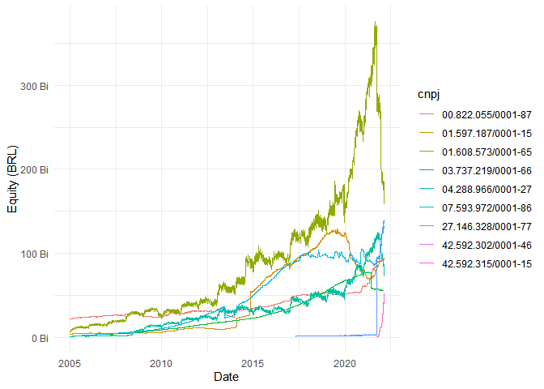
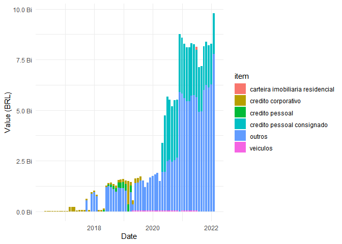

<!-- README.md is generated from README.Rmd. Please edit that file -->

# dadosCVM

<!-- badges: start -->
<!-- badges: end -->

The goal of dadosCVM is to obtain and adjust data of investments funds
registered on Comissão de Valores Mobiliários (Security and Exchange
Commissions from Brazil). Data is collected from files available at
<http://dados.cvm.gov.br/dados/>.

Main goals/ideas are descripted below:

-   cad\_fi(): Download the latest Registration Data (‘Dados
    Cadastrais’) available on CVM at
    <http://dados.cvm.gov.br/dados/FI/CAD/DADOS/> - 90%;
-   dados\_diarios(): Download the daily fund information (CNPJ, fund
    raisings and withdraws, investors’ amount, equity value, share
    value) of selected funds between two dates. Data is available at
    <http://dados.cvm.gov.br/dados/FI/DOC/INF_DIARIO/DADOS/> - under
    development;
-   dados\_fidc(): Develop a function that downloads monthly FIDC data
    between two dates from a specified table of the FIDC files located
    at <http://dados.cvm.gov.br/dados/FIDC/DOC/INF_MENSAL/DADOS/> -
    under development;
-   simpl\_names(): Develop a function that simplifies funds names
    (i.e. transforms ‘FUNDO DE INVESTIMENTO EM DIREITOS CREDITORIOS’ to
    ‘FIDC’) - 0%.

## Installation

You can install the development version of dadosCVM from
[GitHub](https://github.com/) with:

``` r
# install.packages("devtools")
devtools::install_github("lucasan93/dadosCVM")
```

## Examples

### 1: Downloading the latest registration data from CVM:

The function *cad\_fi()* downloads the latest registration data
available on CVM.

``` r
library(dadosCVM)
library(dplyr)
library(kableExtra)
```

Below the top-10 funds in operation are extracted, sorted by their
equity and identified by their CNPJ (Brazil National Registry of Legal
Entities number). Note that the *data.frame* contains 40 columns and
more than 60 thousand observations.

``` r
dados_cadastrais <- cad_fi() %>%
                      filter(situacao == 'EM FUNCIONAMENTO NORMAL') %>% 
                      select(cnpj,
                             classe,
                             tipo,
                             inicio_atv,
                             pl_data,
                             pl) %>% 
                      arrange(desc(pl)) %>% 
                      slice_head(n = 10) %>% 
                      mutate(pl = format(pl, big.mark = ','))

kable(dados_cadastrais)
```

<table>
<thead>
<tr>
<th style="text-align:left;">
cnpj
</th>
<th style="text-align:left;">
classe
</th>
<th style="text-align:left;">
tipo
</th>
<th style="text-align:left;">
inicio\_atv
</th>
<th style="text-align:left;">
pl\_data
</th>
<th style="text-align:left;">
pl
</th>
</tr>
</thead>
<tbody>
<tr>
<td style="text-align:left;">
01.608.573/0001-65
</td>
<td style="text-align:left;">
Fundo de Renda Fixa
</td>
<td style="text-align:left;">
FI
</td>
<td style="text-align:left;">
1997-01-02
</td>
<td style="text-align:left;">
2022-03-23
</td>
<td style="text-align:left;">
159,651,227,089
</td>
</tr>
<tr>
<td style="text-align:left;">
27.146.328/0001-77
</td>
<td style="text-align:left;">
Fundo de Renda Fixa
</td>
<td style="text-align:left;">
FI
</td>
<td style="text-align:left;">
2017-05-03
</td>
<td style="text-align:left;">
2022-03-23
</td>
<td style="text-align:left;">
137,429,549,362
</td>
</tr>
<tr>
<td style="text-align:left;">
07.593.972/0001-86
</td>
<td style="text-align:left;">
Fundo de Renda Fixa
</td>
<td style="text-align:left;">
FI
</td>
<td style="text-align:left;">
2005-09-21
</td>
<td style="text-align:left;">
2022-03-23
</td>
<td style="text-align:left;">
122,607,768,840
</td>
</tr>
<tr>
<td style="text-align:left;">
22.985.157/0001-56
</td>
<td style="text-align:left;">
FIP Multi
</td>
<td style="text-align:left;">
FIP
</td>
<td style="text-align:left;">
2015-09-01
</td>
<td style="text-align:left;">
2021-12-31
</td>
<td style="text-align:left;">
107,568,311,434
</td>
</tr>
<tr>
<td style="text-align:left;">
01.597.187/0001-15
</td>
<td style="text-align:left;">
Fundo de Renda Fixa
</td>
<td style="text-align:left;">
FI
</td>
<td style="text-align:left;">
1996-12-30
</td>
<td style="text-align:left;">
2022-03-23
</td>
<td style="text-align:left;">
95,925,774,092
</td>
</tr>
<tr>
<td style="text-align:left;">
00.822.055/0001-87
</td>
<td style="text-align:left;">
Fundo de Renda Fixa
</td>
<td style="text-align:left;">
FI
</td>
<td style="text-align:left;">
1995-10-02
</td>
<td style="text-align:left;">
2022-03-23
</td>
<td style="text-align:left;">
94,753,353,219
</td>
</tr>
<tr>
<td style="text-align:left;">
42.592.302/0001-46
</td>
<td style="text-align:left;">
Fundo de Renda Fixa
</td>
<td style="text-align:left;">
FI
</td>
<td style="text-align:left;">
2021-09-30
</td>
<td style="text-align:left;">
2022-03-23
</td>
<td style="text-align:left;">
72,417,562,362
</td>
</tr>
<tr>
<td style="text-align:left;">
42.592.315/0001-15
</td>
<td style="text-align:left;">
Fundo de Renda Fixa
</td>
<td style="text-align:left;">
FI
</td>
<td style="text-align:left;">
2021-09-30
</td>
<td style="text-align:left;">
2022-03-23
</td>
<td style="text-align:left;">
72,412,668,571
</td>
</tr>
<tr>
<td style="text-align:left;">
04.288.966/0001-27
</td>
<td style="text-align:left;">
Fundo de Renda Fixa
</td>
<td style="text-align:left;">
FI
</td>
<td style="text-align:left;">
2002-07-15
</td>
<td style="text-align:left;">
2022-03-23
</td>
<td style="text-align:left;">
59,114,466,417
</td>
</tr>
<tr>
<td style="text-align:left;">
03.737.219/0001-66
</td>
<td style="text-align:left;">
Fundo de Renda Fixa
</td>
<td style="text-align:left;">
FI
</td>
<td style="text-align:left;">
2005-08-24
</td>
<td style="text-align:left;">
2022-03-23
</td>
<td style="text-align:left;">
55,208,583,595
</td>
</tr>
</tbody>
</table>

### 2: Obtaining daily data

The function *dados\_diarios()* downloads daily data (CNPJ, portfolio
value, share value, equity, withdraws, fund raisings, and number of
investors) for specifics fund (identified by theis CNPJs) between two
given dates. Note that daily data is only available for funds of type
‘FI’ and that initial date must be greater than 2005-01-01.

``` r
library(dadosCVM)
library(dplyr)
library(ggplot2)
library(scales)
```

Below we obtain data from funds displayed in the previous example and
plot their equity value over time:

``` r
dados_diarios(cnpj  = dados_cadastrais$cnpj,
              start = as.Date('2005-01-01'),
              end   = as.Date('2022-03-01')) %>% 
      select(data, cnpj, pl) %>% 
      ggplot() +
      aes(x = data, y = pl, color = cnpj) +
      geom_line() +
      scale_y_continuous(labels = unit_format(unit = "Bi", scale = 1e-9)) +
      xlab('Date') +
      ylab('Equity (BRL)') +
      theme_minimal()
#> [1] "Obtaining data between 2021-01-01 and 2022-03-01"
#> [1] "Obtaining data between 2005-01-01 and 2022-03-01"
```



### 3: Obtaining FIDC’s monthly portfolio

The function *dados\_fidc()* downloads monthly data for a group of funds
(identified by theis CNPJs) between two given dates and for a specified
database (identified in CVM’s FIDC’s META file) out of 16 different
databases. Initial date must be greater than 2013-01-01.

**This function is currently under development. I’m working on
simplifying column names and adding the opting to pivot the data.frame
format from wide to long.**

``` r
library(dadosCVM)
library(dplyr)
library(tidyverse)
library(ggplot2)
library(scales)
library(kableExtra)
```

First, let’s select the top-10 FIDCs in operation with the highest
equity value and extract their CNPJs and the operations’ start date
using the *cad\_fi* function:

``` r
infos <- cad_fi() %>% 
          filter(situacao == 'EM FUNCIONAMENTO NORMAL',
                 tipo     == 'FIDC') %>% 
          arrange(desc(pl)) %>% 
          slice_head(n = 10) %>% 
          select(cnpj,
                 inicio_atv)
```

Now we obtain the database which provides us with information about the
top-10 funds’ aggregated portfolio. CVM has a ‘META’ file describing the
content of each FIDC database. A quick look at it and we find that the
one we are interested in is the ‘II’ table. Soon the package will
provide a reference database so this search can be done quicker. Note
that although the oldest fund started in 2009, the function
automatically set the start date to 2013-01-01 since there’s no data
prior to that date. Note that the function pivots the CVM databases to
longer and provides two identification columns (‘segment’ and ‘item’),
which greatly facilitates analysis and plots.

``` r
dados_fidc(cnpj  = infos$cnpj,
           start = min(infos$inicio_atv),
           end   = as.Date('2022-02-01'),
           table = 'II') %>% 
        replace(is.na(.), 0) %>% 
        filter(value > 0) %>% 
        group_by(data, segment) %>% 
        summarise(value = sum(value)) %>% 
        ggplot() +
        aes(x = data, y = value, fill = segment) +
        geom_bar(position = 'stack', stat     = 'identity') +
        scale_y_continuous(labels = unit_format(unit = "Bi", scale = 1e-9)) +
        xlab('Date') +
        ylab('Value (BRL)') +
        theme_minimal()
#> [1] "Obtaining data between 2019-01-01 and 2022-02-01"
#> [1] "Obtaining data between 2013-01-01 and 2018-12-31"
```


If we are interested in analyzing the items within a specific segment,
let’s say ‘financeiro’, we can plot the following:

``` r
dados_fidc(cnpj  = infos$cnpj,
           start = min(infos$inicio_atv),
           end   = as.Date('2022-02-01'),
           table = 'II') %>% 
        replace(is.na(.), 0) %>% 
        filter(value > 0, segment == 'financeiro') %>% 
        group_by(data, item) %>% 
        summarise(value = sum(value)) %>% 
        ggplot() +
        aes(x = data, y = value, fill = item) +
        geom_bar(position = 'stack', stat     = 'identity') +
        scale_y_continuous(labels = unit_format(unit = "Bi", scale = 1e-9)) +
        xlab('Date') +
        ylab('Value (BRL)') +
        theme_minimal()
#> [1] "Obtaining data between 2019-01-01 and 2022-02-01"
#> [1] "Obtaining data between 2013-01-01 and 2018-12-31"
```



And in order to verify how the segments and its items are organized
based on their CVM categories, take a look at the *defs\_fidc* database
within the package. **Note that the observations in which item ==
‘total’ are excluded when running the *dados\_fidc()* function in order
to avoid double counting.**

``` r
defs_fidcs %>% 
    filter(str_detect(category, '^TAB_II_')) %>% 
    kable(align = c('l', 'l')) %>% 
    kable_styling(latex_options = 'striped')
```

<table class="table" style="margin-left: auto; margin-right: auto;">
<thead>
<tr>
<th style="text-align:left;">
category
</th>
<th style="text-align:left;">
table
</th>
<th style="text-align:left;">
id
</th>
<th style="text-align:left;">
base
</th>
<th style="text-align:left;">
segment
</th>
<th style="text-align:left;">
class
</th>
<th style="text-align:left;">
item
</th>
</tr>
</thead>
<tbody>
<tr>
<td style="text-align:left;">
TAB\_II\_VL\_CARTEIRA
</td>
<td style="text-align:left;">
II
</td>
<td style="text-align:left;">
II
</td>
<td style="text-align:left;">
carteira
</td>
<td style="text-align:left;">
carteira
</td>
<td style="text-align:left;">
total
</td>
<td style="text-align:left;">
total
</td>
</tr>
<tr>
<td style="text-align:left;">
TAB\_II\_A\_VL\_INDUST
</td>
<td style="text-align:left;">
II
</td>
<td style="text-align:left;">
II.A
</td>
<td style="text-align:left;">
carteira
</td>
<td style="text-align:left;">
industrial
</td>
<td style="text-align:left;">
industrial
</td>
<td style="text-align:left;">
industrial
</td>
</tr>
<tr>
<td style="text-align:left;">
TAB\_II\_B\_VL\_IMOBIL
</td>
<td style="text-align:left;">
II
</td>
<td style="text-align:left;">
II.B
</td>
<td style="text-align:left;">
carteira
</td>
<td style="text-align:left;">
imobiliario
</td>
<td style="text-align:left;">
imobiliario
</td>
<td style="text-align:left;">
imobiliario
</td>
</tr>
<tr>
<td style="text-align:left;">
TAB\_II\_C\_VL\_COMERC
</td>
<td style="text-align:left;">
II
</td>
<td style="text-align:left;">
II.C
</td>
<td style="text-align:left;">
carteira
</td>
<td style="text-align:left;">
comercial
</td>
<td style="text-align:left;">
total
</td>
<td style="text-align:left;">
total
</td>
</tr>
<tr>
<td style="text-align:left;">
TAB\_II\_C1\_VL\_COMERC
</td>
<td style="text-align:left;">
II
</td>
<td style="text-align:left;">
II.C.1
</td>
<td style="text-align:left;">
carteira
</td>
<td style="text-align:left;">
comercial
</td>
<td style="text-align:left;">
comercial
</td>
<td style="text-align:left;">
comercial
</td>
</tr>
<tr>
<td style="text-align:left;">
TAB\_II\_C2\_VL\_VAREJO
</td>
<td style="text-align:left;">
II
</td>
<td style="text-align:left;">
II.C.2
</td>
<td style="text-align:left;">
carteira
</td>
<td style="text-align:left;">
comercial
</td>
<td style="text-align:left;">
varejo
</td>
<td style="text-align:left;">
varejo
</td>
</tr>
<tr>
<td style="text-align:left;">
TAB\_II\_C3\_VL\_ARREND
</td>
<td style="text-align:left;">
II
</td>
<td style="text-align:left;">
II.C.3
</td>
<td style="text-align:left;">
carteira
</td>
<td style="text-align:left;">
comercial
</td>
<td style="text-align:left;">
arrendamento mercantil
</td>
<td style="text-align:left;">
arrendamento mercantil
</td>
</tr>
<tr>
<td style="text-align:left;">
TAB\_II\_D\_VL\_SERV
</td>
<td style="text-align:left;">
II
</td>
<td style="text-align:left;">
II.D
</td>
<td style="text-align:left;">
carteira
</td>
<td style="text-align:left;">
servicos
</td>
<td style="text-align:left;">
total
</td>
<td style="text-align:left;">
total
</td>
</tr>
<tr>
<td style="text-align:left;">
TAB\_II\_D1\_VL\_SERV
</td>
<td style="text-align:left;">
II
</td>
<td style="text-align:left;">
II.D.1
</td>
<td style="text-align:left;">
carteira
</td>
<td style="text-align:left;">
servicos
</td>
<td style="text-align:left;">
servicos
</td>
<td style="text-align:left;">
servicos
</td>
</tr>
<tr>
<td style="text-align:left;">
TAB\_II\_D2\_VL\_SERV\_PUBLICO
</td>
<td style="text-align:left;">
II
</td>
<td style="text-align:left;">
II.D.2
</td>
<td style="text-align:left;">
carteira
</td>
<td style="text-align:left;">
servicos
</td>
<td style="text-align:left;">
servicos publicos
</td>
<td style="text-align:left;">
servicos publicos
</td>
</tr>
<tr>
<td style="text-align:left;">
TAB\_II\_D3\_VL\_SERV\_EDUC
</td>
<td style="text-align:left;">
II
</td>
<td style="text-align:left;">
II.D.3
</td>
<td style="text-align:left;">
carteira
</td>
<td style="text-align:left;">
servicos
</td>
<td style="text-align:left;">
servicos educacionais
</td>
<td style="text-align:left;">
servicos educacionais
</td>
</tr>
<tr>
<td style="text-align:left;">
TAB\_II\_D4\_VL\_ENTRET
</td>
<td style="text-align:left;">
II
</td>
<td style="text-align:left;">
II.D.4
</td>
<td style="text-align:left;">
carteira
</td>
<td style="text-align:left;">
servicos
</td>
<td style="text-align:left;">
servicos entretenimento
</td>
<td style="text-align:left;">
servicos entretenimento
</td>
</tr>
<tr>
<td style="text-align:left;">
TAB\_II\_E\_VL\_AGRONEG
</td>
<td style="text-align:left;">
II
</td>
<td style="text-align:left;">
II.E
</td>
<td style="text-align:left;">
carteira
</td>
<td style="text-align:left;">
agronegocio
</td>
<td style="text-align:left;">
agronegocio
</td>
<td style="text-align:left;">
agronegocio
</td>
</tr>
<tr>
<td style="text-align:left;">
TAB\_II\_F\_VL\_FINANC
</td>
<td style="text-align:left;">
II
</td>
<td style="text-align:left;">
II.F
</td>
<td style="text-align:left;">
carteira
</td>
<td style="text-align:left;">
financeiro
</td>
<td style="text-align:left;">
total
</td>
<td style="text-align:left;">
total
</td>
</tr>
<tr>
<td style="text-align:left;">
TAB\_II\_F1\_VL\_CRED\_PESSOA
</td>
<td style="text-align:left;">
II
</td>
<td style="text-align:left;">
II.F.1
</td>
<td style="text-align:left;">
carteira
</td>
<td style="text-align:left;">
financeiro
</td>
<td style="text-align:left;">
credito pessoal
</td>
<td style="text-align:left;">
credito pessoal
</td>
</tr>
<tr>
<td style="text-align:left;">
TAB\_II\_F2\_VL\_CRED\_PESSOA\_CONSIG
</td>
<td style="text-align:left;">
II
</td>
<td style="text-align:left;">
II.F.2
</td>
<td style="text-align:left;">
carteira
</td>
<td style="text-align:left;">
financeiro
</td>
<td style="text-align:left;">
credito pessoal consignado
</td>
<td style="text-align:left;">
credito pessoal consignado
</td>
</tr>
<tr>
<td style="text-align:left;">
TAB\_II\_F3\_VL\_CRED\_CORP
</td>
<td style="text-align:left;">
II
</td>
<td style="text-align:left;">
II.F.3
</td>
<td style="text-align:left;">
carteira
</td>
<td style="text-align:left;">
financeiro
</td>
<td style="text-align:left;">
credito corporativo
</td>
<td style="text-align:left;">
credito corporativo
</td>
</tr>
<tr>
<td style="text-align:left;">
TAB\_II\_F4\_VL\_MIDMARKET
</td>
<td style="text-align:left;">
II
</td>
<td style="text-align:left;">
II.F.4
</td>
<td style="text-align:left;">
carteira
</td>
<td style="text-align:left;">
financeiro
</td>
<td style="text-align:left;">
middle market
</td>
<td style="text-align:left;">
middle market
</td>
</tr>
<tr>
<td style="text-align:left;">
TAB\_II\_F5\_VL\_VEICULO
</td>
<td style="text-align:left;">
II
</td>
<td style="text-align:left;">
II.F.5
</td>
<td style="text-align:left;">
carteira
</td>
<td style="text-align:left;">
financeiro
</td>
<td style="text-align:left;">
veiculos
</td>
<td style="text-align:left;">
veiculos
</td>
</tr>
<tr>
<td style="text-align:left;">
TAB\_II\_F6\_VL\_IMOBIL\_EMPRESA
</td>
<td style="text-align:left;">
II
</td>
<td style="text-align:left;">
II.F.6
</td>
<td style="text-align:left;">
carteira
</td>
<td style="text-align:left;">
financeiro
</td>
<td style="text-align:left;">
carteira imobiliaria empresarial
</td>
<td style="text-align:left;">
carteira imobiliaria empresarial
</td>
</tr>
<tr>
<td style="text-align:left;">
TAB\_II\_F7\_VL\_IMOBIL\_RESID
</td>
<td style="text-align:left;">
II
</td>
<td style="text-align:left;">
II.F.7
</td>
<td style="text-align:left;">
carteira
</td>
<td style="text-align:left;">
financeiro
</td>
<td style="text-align:left;">
carteira imobiliaria residencial
</td>
<td style="text-align:left;">
carteira imobiliaria residencial
</td>
</tr>
<tr>
<td style="text-align:left;">
TAB\_II\_F8\_VL\_OUTRO
</td>
<td style="text-align:left;">
II
</td>
<td style="text-align:left;">
II.F.8
</td>
<td style="text-align:left;">
carteira
</td>
<td style="text-align:left;">
financeiro
</td>
<td style="text-align:left;">
outros
</td>
<td style="text-align:left;">
outros
</td>
</tr>
<tr>
<td style="text-align:left;">
TAB\_II\_G\_VL\_CREDITO
</td>
<td style="text-align:left;">
II
</td>
<td style="text-align:left;">
II.G
</td>
<td style="text-align:left;">
carteira
</td>
<td style="text-align:left;">
cartao de credito
</td>
<td style="text-align:left;">
cartao de credito
</td>
<td style="text-align:left;">
cartao de credito
</td>
</tr>
<tr>
<td style="text-align:left;">
TAB\_II\_H\_VL\_FACTOR
</td>
<td style="text-align:left;">
II
</td>
<td style="text-align:left;">
II.H
</td>
<td style="text-align:left;">
carteira
</td>
<td style="text-align:left;">
factoring
</td>
<td style="text-align:left;">
total
</td>
<td style="text-align:left;">
total
</td>
</tr>
<tr>
<td style="text-align:left;">
TAB\_II\_H1\_VL\_PESSOA
</td>
<td style="text-align:left;">
II
</td>
<td style="text-align:left;">
II.H.1
</td>
<td style="text-align:left;">
carteira
</td>
<td style="text-align:left;">
factoring
</td>
<td style="text-align:left;">
pessoal
</td>
<td style="text-align:left;">
pessoal
</td>
</tr>
<tr>
<td style="text-align:left;">
TAB\_II\_H2\_VL\_CORP
</td>
<td style="text-align:left;">
II
</td>
<td style="text-align:left;">
II.H.2
</td>
<td style="text-align:left;">
carteira
</td>
<td style="text-align:left;">
factoring
</td>
<td style="text-align:left;">
corporativo
</td>
<td style="text-align:left;">
corporativo
</td>
</tr>
<tr>
<td style="text-align:left;">
TAB\_II\_I\_VL\_SETOR\_PUBLICO
</td>
<td style="text-align:left;">
II
</td>
<td style="text-align:left;">
II.I
</td>
<td style="text-align:left;">
carteira
</td>
<td style="text-align:left;">
setor publico
</td>
<td style="text-align:left;">
total
</td>
<td style="text-align:left;">
total
</td>
</tr>
<tr>
<td style="text-align:left;">
TAB\_II\_I1\_VL\_PRECAT
</td>
<td style="text-align:left;">
II
</td>
<td style="text-align:left;">
II.I.1
</td>
<td style="text-align:left;">
carteira
</td>
<td style="text-align:left;">
setor publico
</td>
<td style="text-align:left;">
precatorios
</td>
<td style="text-align:left;">
precatorios
</td>
</tr>
<tr>
<td style="text-align:left;">
TAB\_II\_I2\_VL\_TRIBUT
</td>
<td style="text-align:left;">
II
</td>
<td style="text-align:left;">
II.I.2
</td>
<td style="text-align:left;">
carteira
</td>
<td style="text-align:left;">
setor publico
</td>
<td style="text-align:left;">
creditos tributarios
</td>
<td style="text-align:left;">
creditos tributarios
</td>
</tr>
<tr>
<td style="text-align:left;">
TAB\_II\_I3\_VL\_ROYALTIES
</td>
<td style="text-align:left;">
II
</td>
<td style="text-align:left;">
II.I.3
</td>
<td style="text-align:left;">
carteira
</td>
<td style="text-align:left;">
setor publico
</td>
<td style="text-align:left;">
royalties
</td>
<td style="text-align:left;">
royalties
</td>
</tr>
<tr>
<td style="text-align:left;">
TAB\_II\_I4\_VL\_OUTRO
</td>
<td style="text-align:left;">
II
</td>
<td style="text-align:left;">
II.I.4
</td>
<td style="text-align:left;">
carteira
</td>
<td style="text-align:left;">
setor publico
</td>
<td style="text-align:left;">
outros
</td>
<td style="text-align:left;">
outros
</td>
</tr>
<tr>
<td style="text-align:left;">
TAB\_II\_J\_VL\_JUDICIAL
</td>
<td style="text-align:left;">
II
</td>
<td style="text-align:left;">
II.J
</td>
<td style="text-align:left;">
carteira
</td>
<td style="text-align:left;">
acoes judiciais
</td>
<td style="text-align:left;">
acoes judiciais
</td>
<td style="text-align:left;">
acoes judiciais
</td>
</tr>
<tr>
<td style="text-align:left;">
TAB\_II\_K\_VL\_MARCA
</td>
<td style="text-align:left;">
II
</td>
<td style="text-align:left;">
II.K
</td>
<td style="text-align:left;">
carteira
</td>
<td style="text-align:left;">
prop intelectual
</td>
<td style="text-align:left;">
prop intelectual
</td>
<td style="text-align:left;">
prop intelectual
</td>
</tr>
</tbody>
</table>

### 4: Obtaining FIDC’s assets

Now let’s start developing a fund’s balance sheet. We can see through
the *tabs\_fidc* database available in the **dadosCVM** package that the
assets’ data are located in the first table:

``` r
tabs_fidcs %>% 
kable(align = c('l', 'l')) %>% 
    kable_styling(latex_options = 'striped')
```

<table class="table" style="margin-left: auto; margin-right: auto;">
<thead>
<tr>
<th style="text-align:left;">
tabela
</th>
<th style="text-align:left;">
conteudo
</th>
</tr>
</thead>
<tbody>
<tr>
<td style="text-align:left;">
I\_TODOS
</td>
<td style="text-align:left;">
informacoes cadastrais dos fundos e ativos
</td>
</tr>
<tr>
<td style="text-align:left;">
II
</td>
<td style="text-align:left;">
classificacoes da carteira
</td>
</tr>
<tr>
<td style="text-align:left;">
III
</td>
<td style="text-align:left;">
passivos
</td>
</tr>
<tr>
<td style="text-align:left;">
IV
</td>
<td style="text-align:left;">
patrimonio liquido
</td>
</tr>
<tr>
<td style="text-align:left;">
V
</td>
<td style="text-align:left;">
direitos creditorios classificados por prazo de vencimento inadimplencia
e pagamentos antecipados
</td>
</tr>
<tr>
<td style="text-align:left;">
VI
</td>
<td style="text-align:left;">
direitos creditorios classificados por prazo de vencimento inadimplencia
e pagamentos antecipados
</td>
</tr>
<tr>
<td style="text-align:left;">
VII
</td>
<td style="text-align:left;">
aquisicoes substituicoes e recompras
</td>
</tr>
<tr>
<td style="text-align:left;">
IX
</td>
<td style="text-align:left;">
taxas de desconto e de juros das compras e vendas
</td>
</tr>
<tr>
<td style="text-align:left;">
X\_1
</td>
<td style="text-align:left;">
informacoes sobre cotistas por classe e serie
</td>
</tr>
<tr>
<td style="text-align:left;">
X\_1\_1
</td>
<td style="text-align:left;">
classificacoes dos cotistas
</td>
</tr>
<tr>
<td style="text-align:left;">
X\_2
</td>
<td style="text-align:left;">
informacoes sobre as cotas
</td>
</tr>
<tr>
<td style="text-align:left;">
X\_3
</td>
<td style="text-align:left;">
rentabilidade
</td>
</tr>
<tr>
<td style="text-align:left;">
X\_4
</td>
<td style="text-align:left;">
transacoes de cotas do fundo
</td>
</tr>
<tr>
<td style="text-align:left;">
X\_5
</td>
<td style="text-align:left;">
ativos classificados pela liquidez
</td>
</tr>
<tr>
<td style="text-align:left;">
X\_6
</td>
<td style="text-align:left;">
taxas de desempenho real e esperada
</td>
</tr>
<tr>
<td style="text-align:left;">
X\_7
</td>
<td style="text-align:left;">
garantias
</td>
</tr>
</tbody>
</table>

Let’s then gather the largest FIDC’s assets data and plot its main
segments:

``` r
dados_fidc(cnpj  = infos$cnpj[1],
           start = infos$inicio_atv[1],
           end   = as.Date('2022-03-31'),
           table = 'I') %>%
      filter(base == 'ativo', value != 0) %>% 
      group_by(data, segment) %>% 
              summarise(valor = sum(value)) %>% 
      ggplot() +
      aes(x = data, y = valor, fill = segment) +
      geom_bar(position = 'stack', stat     = 'identity') +
      scale_y_continuous(labels = unit_format(unit = "Bi", scale = 1e-9)) +
      xlab('Date') +
      ylab('Value (BRL)') +
      theme_minimal()
#> [1] "Obtaining data between 2019-01-01 and 2022-02-28"
#> [1] "Obtaining data between 2016-04-20 and 2018-12-31"
```


We can also analyze the items within each asset segment:

``` r
dados_fidc(cnpj  = infos$cnpj[1],
           start = infos$inicio_atv[1],
           end   = as.Date('2022-03-31'),
           table = 'I') %>%
      filter(base == 'ativo', value != 0) %>% 
      group_by(data, segment, item) %>% 
              summarise(valor = sum(value)) %>% 
      ggplot() +
      aes(x = data, y = valor, fill = item) +
      geom_bar(position = 'stack', stat     = 'identity') +
      scale_y_continuous(labels = unit_format(unit = "MM", scale = 1e-6)) +
      xlab('Date') +
      ylab('Value (BRL)') +
      theme_minimal() +
      facet_wrap(~segment, scales = 'free_y')
#> [1] "Obtaining data between 2019-01-01 and 2022-02-28"
#> [1] "Obtaining data between 2016-04-20 and 2018-12-31"
```


